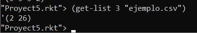
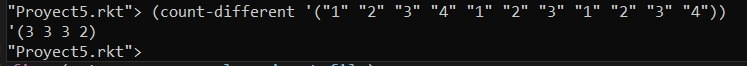
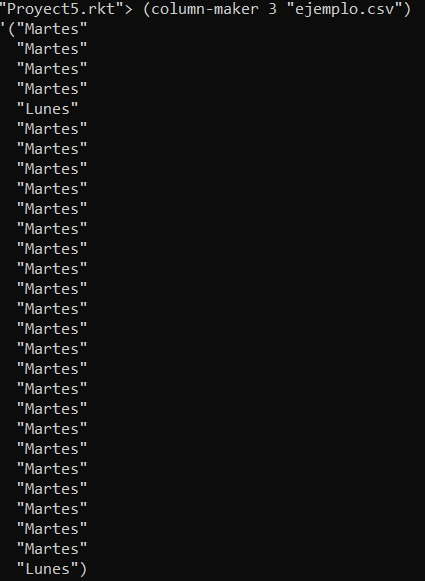
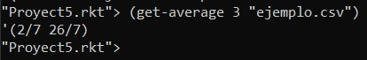
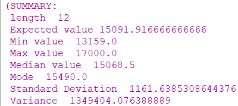
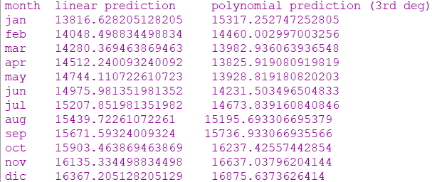

# Exploratory Statistics and Linear Algebra Predictions in Racket
For the Final project,  we want to write a program in Racket that can open a .csv file, read its contents and process the data inside.
The program recieves a csv file, reads it line per line, chooses only one column and stores it in a list. From that list, the program then sorts the list so it is in order, and then gets how many different elements are in the list and counts it. The variables will be processed to get statistics that will broadly indicate the distribution of the set (expected value, median, mode, standard deviation of the set, etc..). In our program we will also implement some algorithms to generate prediction models, particularly linear and polynomial regression, of the variables. 
The Program uses 3 diferent ways to get the statistics:
* **Linear Regresion** Linear regression attempts to model the relationship between two variables by fitting a linear equation to observed data. One variable is considered to be an explanatory variable, and the other is considered to be a dependent variable.
A linear regression line has an equation of the form Y = a + bX, where X is the explanatory variable and Y is the dependent variable. The slope of the line is b, and a is the intercept (the value of y when x = 0).
* **Polynomial Regression**  Polynomial Regression is a form of linear regression in which the relationship between the independent variable x and dependent variable y is modeled as an nth degree polynomial. Polynomial regression fits a nonlinear relationship between the value of x and the corresponding conditional mean of y, denoted E(y |x). A polynomial regression line has an equation of the form y = a + b1x + b2x^2 +....+ bnx^n, where x is the explanatory variable and Y is the dependent variable. The slope of the line is b, and a is the intercept (the value of y when x = 0).
* **Poisson Distribution** Poisson Distribution is a statistical distribution that shows how many times an event is likely to occur within a specified period of time. It is used for independent events which occur at a constant rate within a given interval of time. The Poisson distribution is a discrete function, meaning that the event can only be measured as occurring or not as occurring, meaning the variable can only be measured in whole numbers. Fractional occurrences of the event are not a part of the model. it was named after French mathematician Siméon Denis Poisson. The poisson distribution has an equation of the form P(x; μ) = (e ^-μ) (μ^x) / x!, where x is the actual number to search, e is the euler number with a value of 2.71828 and μ is the lambda or the mean. 


## Getting Started
These instructions will get you a copy of the project up and running on your local machine for development and testing purposes. See deployment for notes on how to deploy the project on a live system.

### Prerequisites
With these instructions we assusme you are using UBUNTU Linux and that you have downloaded this git repository. 
You will need to download the file named "incidentes-viales-c5.csv" from this [link](https://drive.google.com/drive/folders/1an6jfWfjKKtN1W5aaE2LgwHNjTl8VL_z?usp=sharing)

You will need to install git and racket
``` 
sudo apt instal git 
```
``` 
sudo apt instal racket
```
### Install
A step by step instructions to run the proyect

Install git

``` 
sudo apt instal git
```
Install racket
``` 
sudo add-apt-repository ppa:plt/racket
```
``` 
sudo apt-get update
```
``` 
sudo apt-get install racket
```

And to run 
``` 
racket
```
``` 
(enter! "finalProject.rkt")
```
The program will currently default to the hardcoded data available, namely the following definitions.

``` 
(define independent '(1 2 3 4 5 6 7 8 9 10 11 12))
(define dependent '(15490 13810 14804 13159 14503 14481 13929 15356 15333 17000 16436 16802))
(define months '(jan feb mar apr may jun jul aug sep oct nov dic))
```

It then will use these averages to produce the statistical overview.
``` 
(overview dependent)
```

Further ahead, it will automatically train the polynomial model and call it to produce the predicted list
``` 
(define modelPLSR (trainPLSR independent dependent))

(define polyList (PLSR modelPLSR independent))
```

It then will call the visualization functions using the data provided

``` 
(visualizePredict independent dependent months)
```

Lastly, it will display a plot of the prediction functions that were produced.
``` 
(plot (list (points(map vector independent dependent))
            (function (λ (x) (PLSR modelPLSR x)) (min independent) (max independent) #:label "Polynomial") 
            (function (λ (x) (LSR independent dependent x)) (min independent) (max independent) #:color 0 #:style 'dot #:label "Linear"))
        #:x-min (min independent) #:x-max (max independent) #:y-min (- (min polyList) (standard-deviation polyList)) #:y-max (+ (max polyList) (standard-deviation polyList)))
```

## Running the tests
Move to the folder
To run the tests you first

### Run the program

To use the program we use 
``` 
(enter! "finalProject.rkt")
```

``` 
()
```

## Functions 
* **get-list**  gets as an argument a file and a number. The file is the name of the file we have to use and the number is the number of the column we want to use. It returns a list that first uses column-maker to change the csv file  column to a list. Then it uses count-different to count the number of different elements are in the list and then count the number instances each element has. It returns a list that has the numebr of different elements and it's count
  * ``` 
      (get-list 3 "ejemplo.csv")
      ```
  * 
* **count-different** gets a list as an argument. From the list it gets the different elements of the list and counts the number of time that element appeared on the list.
  * ``` 
      (count-different '("1" "2" "3" "4" "1" "2" "3" "1" "2" "3" "4"))
      ```
  * 
* **column-maker** gets as an argument a number and the name of a csv file. The function reads the file line per line. In each line it sends for split to create a list from the line, then it sends the list with the number to look up the element of that list that is in.
  * ``` 
      (column-maker 3 "ejemplo.csv")
      ```
  * 
 * **get-average** gets as an argument a number and the name of a csv file. The function gets a list get-list and returns the average of each element of the file divided by 7, that are the number of the years the file has. 
   * ``` 
      (get-averager 3 "ejemplo.csv")
      ```
  * 
  
* **len** calculate length of list
* **sum** calculate addition of all the elements within the list
* **average** calculate average of list
* **max** retrieve maximum value of list
* **min** retrieve minimum value of list
* **median** retrieve median value of list
* **count** count the number of times an element is repeated within a list 
* **mode** return the most frequent element within a list
* **standard-deviation** calculate standard deviation of the set
* **factorial** function to calculate factorial of given number
* **overview** applies all the previous functions to the given list and displays all the results in a new list.
  * 

* **PoissPdf** function to calculate the probability of x given lambda as a Poisson Process
* **PoissCdf** function to calculate the probability of range (a b) given lambda as a Poisson Process

* **LSR** function to train linear model with the x and y data provided, it accepts both an exact value and a range of values to produce
the prediction result. 

* **trainLSR** given the x and y train lists, produces the prediction model for the third degree polynomial which consist of a coefficient vector to be applied to the prediciton function.

* **PLSR** given a value or a list of values, uses the model of trainLSR to produce the polynomial prediction procedure from which the
user can input any in-bound value and get a prediction for a month.

* **visualizePredict** displays the linear and polynomial prediction by month, given the x and y train data.
 * 


## Description of the program
The program recieves a csv file, gets a column from the file, gets the diferent elements that are in that column and counts the number of instances each element has in that column.

Provided the averages in a list format, the program is able to perform a battery of basic statistical analysis to broadly indicate its
distribution.

It later produces the following prediction functions:
 * Least Squares Linear Regression
 * Least Squares Third Degreee Polynomial Regression
 
 Which in turn produce the predicted values based on the data consumed. 

## Topics Used 
 * **FILE INPUT**
 * **FUNCTIONAL PROGRAMMING** 
 * **LISTS**
 * **RECURSION** 


## Requirements
You need to use ubuntu or DrRacket in Windows. 

## Built With
* [Ubuntu](https://ubuntu.com/) - the operating system
* [Visual Studio Code](https://code.visualstudio.com/) - Text Editor
* [Racket](https://racket-lang.org/) - Text Editor


## Authors
* **Eduardo Badillo Alvarez A01020716**
* **Isabel Maqueda Rolon A01652906**
 


## License
This project is licensed under the TEC License

## Acknowledgments
* [Guillermo Echeverria](https://github.com/gilecheverria)
* [Linear Regression](http://www.stat.yale.edu/Courses/1997-98/101/linreg.htm)
* [Poisson Distribution](https://stattrek.com/probability-distributions/poisson.aspx#:~:text=Poisson%20Formula.,(%CE%BCx)%20%2F%20x!&text=The%20mean%20of%20the%20distribution%20is%20equal%20to%20%CE%BC%20.)
